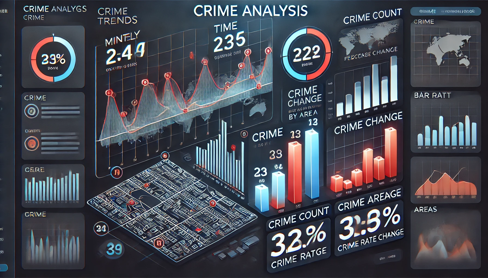
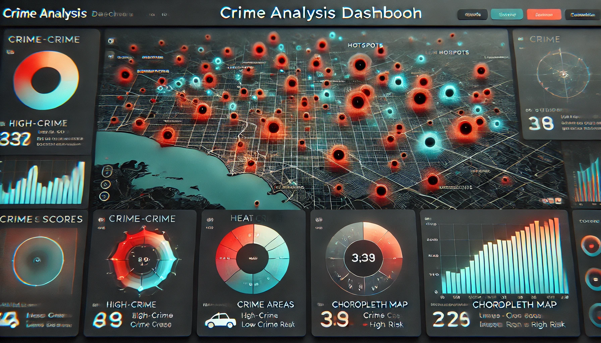
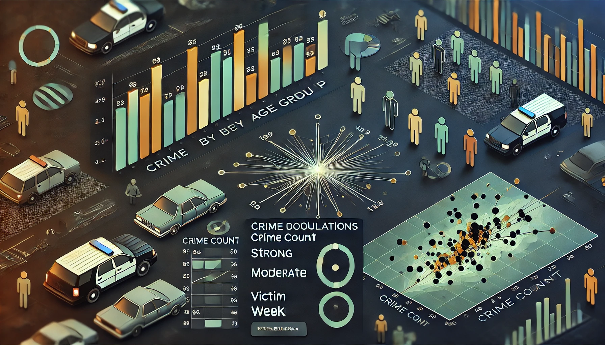
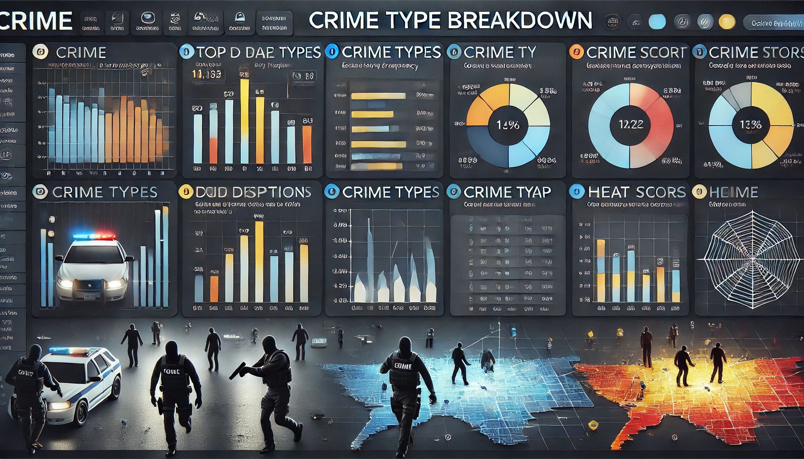

# Crime Analysis Dashboard

## 1. Overview Section (Header & Filters)

🔹 **Filters:**

- **Date Range:** Year/Month (dateyear_occ, datemon_occ)
- **Area:** area_name or area_id
- **Crime Type:** crm_cd_desc
- **Victim Age Group:** vict_age_group

## 2. Key Metrics Summary (Scorecards)

📊 **High-Level KPIs:**

- **Total Crimes:** Sum of crime_count
- **Avg Crimes per Day:** avg_crimes_per_day
- **Crime Density:** crime_density (Low, Medium, High)
- **Top Crime Type:** Mode of crm_cd_desc
- **Crime Score (Overall Risk Level):** crime_score
- **Change in Crime Rate (Monthly % Change):** pct_change_avg_crimes_per_day_by_area
- **Crime Correlation Strength by Age Group:** corr_crime_count_age_group_strength

## 3. Crime Trends & Analysis

📈 **Time Series Charts:**

- **Crimes Over Time (Monthly):** datemon_occ vs. crime_count
- **Crime Rate Change by Area:** area_name vs. pct_change_avg_crimes_per_day_by_area
- **Crime Rate by Crime Type:** crm_cd_desc vs. pct_change_avg_crimes_per_day_by_area_crmcd
- **Crime Score Trends by Area:** area_name vs. crime_score

📊 **Ranking Tables:**

- **Top 10 Most Affected Areas:** area_name, avg_crimes_per_day_by_area_ranking
- **Top 5 Crime Types by Impact:** crm_cd_desc, crime_score_by_crmcd

## 4. Geographic Crime Distribution

🗺 **Maps:**

- **Crime Hotspots:** Bubble map with lat, lon, sized by crime_count
- **Crime Density by Area:** Heatmap with geo_display_name colored by crime_density
- **Crime Score by Area:** Choropleth map based on crime_score

## 5. Crime Demographics & Correlations

👥 **Charts & Tables:**

- **Crime Count by Age Group:** Bar chart (vict_age_group vs. crime_count)
- **Top 5 Age Groups for Crimes:** Table (vict_age_group, crime_score_by_age_group)
- **Correlation Between Age and Crime Type:** Scatter plot (corr_crime_count_age_group)

## 6. Crime Type Breakdown

⚖ **Tables & Charts:**

- **Top 10 Crime Types:** Ranked bar chart (crm_cd_desc, crime_count)
- **Crime Type vs. Area:** Heatmap (crm_cd_desc vs. area_name)
- **Crime Score by Crime Type:** Table (crm_cd_desc, crime_score_by_crmcd)

## 7. Insights & Recommendations

📌 **Narrative Insights Section:**

- Summary of crime trends, significant findings
- Areas with increasing/decreasing crime rates
- High-risk crime types & affected demographics
- Recommendations for law enforcement